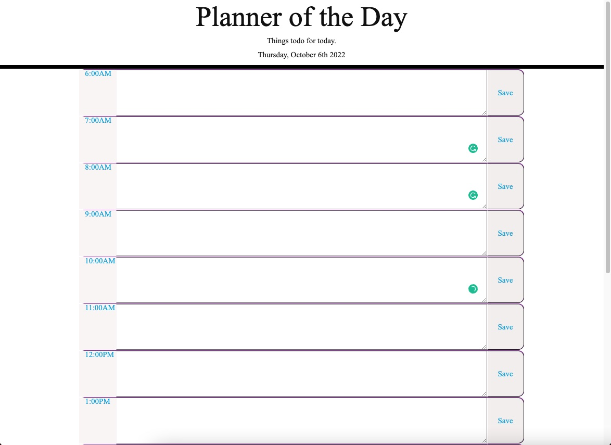

# planner

;

## Techonlogies Used
During this project. I used the following techonlogies 
- Index.html 
- CSS 
- README.md 
- script.js
- Gitlab 
- Github

## Description
 This project is to set a day planner. I have added time 6am to 7pm which we usually work or be active during those times. You can type in the row of what you need to do during those hours and press save to save those informations. 
## Credits
N/A

## Deployed link
https://rlee7029.github.io/planner/